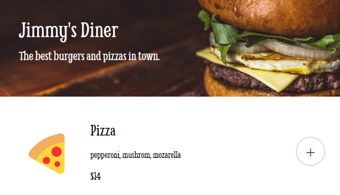

# Jimmy's Diner Ordering App

A restaurant ordering application that allows customers to select menu items, review their order, and complete the payment process.

[Live Demo](https://adorable-valkyrie-3bb0f8.netlify.app/)



## About

This project was created as part of The Frontend Developer Career Path at Scrimba. It simulates a digital menu and ordering system for a restaurant called Jimmy's Diner.

## Features

- Browse restaurant menu items
- Add items to your order
- Remove items from your order
- View order total
- Complete checkout with a payment form
- Receive order confirmation

## Technologies

- HTML
- CSS
- JavaScript (ES6+)
- JavaScript Modules
- UUID library for generating unique IDs
- Google Fonts (Smythe, Inter)

## Project Structure

```
restaurant-ordering/
├── images/
│   └── cover.png
├── index.html
├── index.css
├── index.js
├── data.js
└── README.md
```

## How it works

1. Browse the menu and click the "+" button to add items to your order
2. Review your order in the "Your Order" section
3. Remove unwanted items by clicking "remove" next to any item
4. Click "Complete order" when you're ready to checkout
5. Fill in your payment details in the modal form
6. Submit payment to complete your order
7. Receive a confirmation message that your order is on the way

## Application Architecture

The application follows a clean separation of concerns:

- **Data Layer**: Menu items are stored in a separate data.js file
- **State Management**: Order array tracks the current order items
- **Event Handlers**: Functions to handle user interactions
- **Render Functions**: Functions to update the UI based on state changes
- **Modal Management**: Functions to handle the payment modal

## Running the project

Clone the repository and open `index.html` in your browser:

```bash
git clone https://github.com/phattp/restaurant-ordering.git
cd restaurant-ordering
```

## What I learned

- Managing application state
- Working with JavaScript modules
- Creating and manipulating DOM elements dynamically
- Implementing a modal for payment processing
- Handling form submissions
- Creating an accessible and user-friendly interface
- Using event delegation for efficient event handling

---

Created by [Phatthara Pisootrapee](https://github.com/phattp) | [The Frontend Developer Career Path at Scrimba](https://scrimba.com/learn/frontend)
